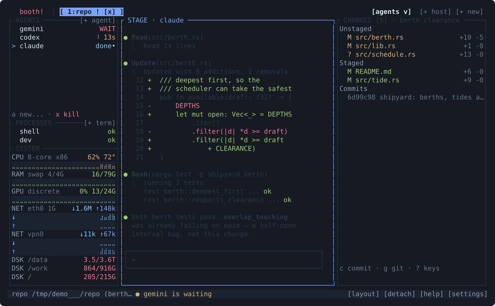
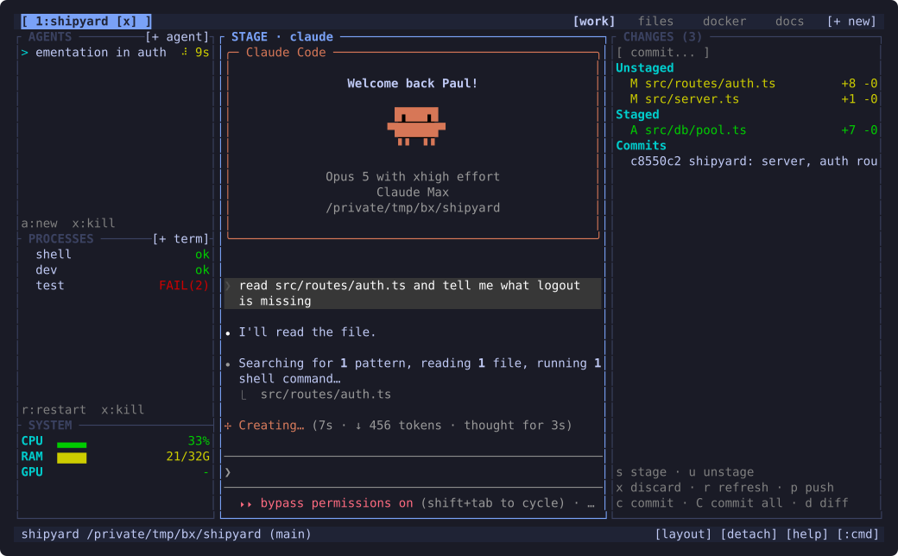
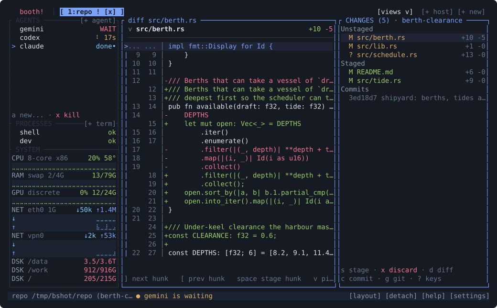

<div align="center">

# butai

**All your coding agents on one screen. Close it — nothing stops.**

A terminal workbench for coding agents: who's stuck, who's done, what they
changed — plus the dev server they just broke and the diff they wrote. A
background daemon owns all of it, so closing the terminal stops nothing and
reattaching from another machine picks up mid-sentence.

[](https://github.com/dieterpl/butai/actions/workflows/ci.yml)
[](LICENSE)
[](#install)
[](rust-toolchain.toml)



</div>

## Why

**tmux holds the process. It has no idea what is happening inside it.**

A coding agent runs for minutes and then wants your attention. tmux can hold
that process; it cannot tell you which of the ones you started is blocked on a
question, which finished while you were elsewhere, and which is quietly burning
tokens. butai can, because it reads the agents.

It is a terminal workbench with one fixed screen built around the loop you
actually run: start agents, watch your server and tests, read the diff, commit.
Each project is a tab. Nothing splits and nothing rearranges, so after the first
day you stop looking for things and start glancing at them.

It runs `claude`, `codex`, `gemini`, `aider` and `agy` out of the box, and
anything else you name in an `[[agents]]` block — all of them in one rail, on
one keymap. **The workbench outlives all of them:** harnesses come and go, and
this is the frame they run inside.

All of it belongs to a background daemon, so closing the terminal doesn't stop
anything — the editor buffer you haven't saved, the git stage you're halfway
through, and the agent that's been running for an hour keep going. Reattach
later, or over SSH from another machine, and it's mid-sentence where you left it.

- **Agents are first-class.** They're ordinary CLIs in PTY panes — no wrapper
  protocol, full TUI fidelity — but the daemon watches them and surfaces
  `[!]` needs-you, `[~]` working, `[ ]` idle in a rail you can scan in one look.
- **One workspace per project.** A tab is a project directory. Opening it brings
  your dev processes up like a Procfile and spawns your usual agents.
- **Review without leaving.** Git changes live in a permanent rail: stage,
  unstage, diff, and commit right where you're working.
- **Nothing new to secure.** The daemon never listens on TCP — it binds one
  `AF_UNIX` socket. Reaching a machine that isn't this one rides the SSH you
  already have: your keys are the authentication, the socket's filesystem
  permissions are the authorisation. No inbound port, no tunnel service, no
  token to leak, and no URL that has to be treated like a root login. There is
  no new attack surface because there is no new listener.
- **You can build on it.** Embed the daemon and your product gets agents, a
  file tree, diffs, staging, commits, branches and process supervision while
  the interface stays yours — over a [documented API](docs/protocol.md), with
  no terminal emulator to write.

> **Already have tmux?** Keep it — it isn't going anywhere, and if you don't run
> coding agents it is the better tool and has been for twenty years. butai is
> for the afternoon where four agents are working, one is blocked, something is
> on fire in the test run, and you can't tell which is which.

## Install

```sh
curl -fsSL https://raw.githubusercontent.com/dieterpl/butai/main/scripts/install.sh | sh
```

That detects your platform, downloads the matching prebuilt binary, verifies it
against the release's `SHA256SUMS`, and drops `butai` in `/usr/local/bin` or
`~/.local/bin`. No runtime and no dependencies — it's one binary.
[Read it first](scripts/install.sh) if you'd rather; it's POSIX `sh`.

**You only run that once.** After the first install butai keeps itself current:
when a newer release exists it asks, once, and `yes` swaps the binary and
restarts onto it with your workspaces, agents and scrollback intact. `no` means
that version, not that question, so it stops asking about it and still tells you
about the next one. `butai update` is the same thing on demand, and
`[update] check = false` turns it off.

**A daemon on another machine updates itself.** A remote session is two butais,
and updating the one in front of you leaves the one doing the work as it was.
`butai update --daemon` — or `:update` on a tab from another machine — hands the
whole job to the daemon over there: check, download, verify, restart, workspaces
restored. It has to be allowed on that side, with `[update] allow_remote = true`.

Pin a version or pick your own directory:

```sh
curl -fsSL .../install.sh | BUTAI_VERSION=v1.0.0 BUTAI_INSTALL_DIR=~/bin sh
```

<details>
<summary>Other ways</summary>

**From a release tarball.** Grab it from the
[latest release](https://github.com/dieterpl/butai/releases/latest) and put
`butai` on your `PATH`. Every release ships the same tarball layout for each
target below.

| Platform | Targets |
| --- | --- |
| Linux (glibc) | `x86_64-unknown-linux-gnu`, `aarch64-unknown-linux-gnu`, `armv7-unknown-linux-gnueabihf` |
| Linux (static, no libc dependency) | `x86_64-unknown-linux-musl`, `aarch64-unknown-linux-musl` |
| macOS | `aarch64-apple-darwin`, `x86_64-apple-darwin` |

The `musl` builds are fully static — they run on Alpine, on a distroless or
scratch container, and on any glibc too old for the `gnu` builds.

**From source.** Needs Rust 1.88+.

```sh
git clone https://github.com/dieterpl/butai
cd butai
cargo install --path crates/butai
```

**Build the release artifacts yourself.** `scripts/release.sh` produces the
whole matrix above as tarballs under `dist/`. Linux targets cross-compile via
[`cross`](https://github.com/cross-rs/cross) (needs Docker); macOS targets
build natively. `TARGETS="..." scripts/release.sh` builds a subset.

</details>

> **Windows is not supported natively.** The transport is Unix domain sockets,
> the client drives the terminal through `termios` and POSIX signals, and the
> daemon detaches with `setsid`. A port needs a named-pipe or loopback-TCP
> transport and a Console API backend for the client — not a build target.
> Under WSL2 butai runs as an ordinary Linux binary today.

## Quick start

```sh
cd ~/Projects/my-app
butai                    # attach to the latest session (create if none)
```

That's the whole ceremony. Then:

```sh
butai new -s work               # new named session
butai ls                        # list sessions
butai attach -t work            # reattach
butai kill-session -t work
butai kill-server             # stops it; your workspaces come back next time
butai kill-server --clear    # ...and forget them, so the next start is empty
butai reset                     # shell spewing mouse codes after a crash? fixes it
```

### Scripting the daemon

The daemon serves a JSON API on the same socket, and the CLI is a client of it —
the way `docker` is a client of dockerd. Anything the CLI can do, a script or a
GUI can do over HTTP:

```sh
butai workspace ls                      # every project, with agent/process counts
butai ws show my-app                    # one workspace's agents, processes, changes
butai ws create --cwd ~/Projects/api    # open a project without attaching
butai ws rm my-app

butai ws ls --json | jq '.[] | select(.waiting > 0) | .name'
```

`--json` re-emits the daemon's own response body, so what a script parses is
exactly what [`GET /v1/workspaces`](docs/protocol.md) returns — the CLI cannot
drift from the API. `--quiet` prints nothing and leaves the exit code as the
answer. `--socket` picks a daemon; `--ws` sets the workspace scope and defaults
to `$BUTAI_WORKSPACE`.

### From inside a pane

Every pane carries `$BUTAI_PANE`, `$BUTAI_WORKSPACE` and `$BUTAI_SOCKET`, so a
program running in one — a script, a plugin, or an agent — can drive the
workbench around it with no configuration:

```sh
butai whoami                            # which pane am I, in which workspace
butai pane ls                           # my siblings, mine marked
butai pane read 7 --lines 50            # what pane 7 has been saying, as plain text

P=$(butai agent spawn claude --background)  # a helper, without stealing the view
butai agent send $P "summarise ./logs" --wait
butai pane read $P --lines 40
```

`butai agent wait` is the verb that makes this coordination rather than poking:
it blocks until an agent reaches `finished`, `exited`, or whatever `--until`
names, and reports which through its exit code — so `butai agent wait 7 -q &&
./deploy.sh` does the right thing. See [`docs/agents.md`](docs/agents.md).

## The workbench



Every workspace — one per project, one per tab — has the same fixed frame:
**AGENTS**, **PROCESSES**, and **SYSTEM** (cpu/ram/gpu gauges) rails on the
left, a **CHANGES** rail (git) on the right, and one **stage** in the center
holding the agent you're steering, the code you're reading, a process log, or
a diff.

The rails never move. That's deliberate — you learn the geography once and
stop thinking about layout. Rails are status lists, not terminals: agents show
`[!]` / `[~]` / `[ ]`, processes show `ok` / `FAIL(n)`, and an agent that needs
you badges its workspace tab so you can see it from another project.

The reasoning behind all of this is written up in [docs/design.md](docs/design.md).

### Keys — `Alt` is chrome, everything else goes to the focused thing

| key | action | | key | action |
|---|---|---|---|---|
| `Alt-1..9` | switch workspace tab | | `Alt-Enter` | agent picker |
| `Alt-a / p / g` | focus agents / processes / changes | | `Alt-e` | editor on stage |
| `Alt-o / c / m / r / u` | files / docker / docs / git / usage | | `Alt-t` | new shell process |
| `Alt-z` | zen (collapse rails) | | `C-b S` | system monitor on the stage |
| `Alt-Esc` | leave the stage | | `C-b d` | detach |
| `C-b :` | command prompt | | `C-b PgUp/PgDn` | stage scrollback |

**Rails**: `j/k` select, `Enter` puts it on the stage, `x` kill, `a` new agent,
`r` restart process, `m` the row's menu.

**Everything has a key.** Every button, row, gauge and menu entry in the
workbench is reachable from the keyboard — that is a test
(`every_click_target_has_a_key`), not an aspiration. The footer under a list
shows the verbs that fit; `?` and [docs/keys.md](docs/keys.md) show the rest,
and anything can be rebound in `[keys]`.

**Changes**: the rail's keys follow the selected row, and the footer always
names the ones that apply — so there is no table to memorise and nothing bound
that you cannot see.

| selected row | verbs |
|---|---|
| unstaged file | `s` stage · `x` discard (asks first) · `d` diff |
| staged file | `u` unstage · `d` diff |
| conflicted file | `o` take ours · `t` take theirs · `a` mark resolved · `d` diff |
| a commit | `d` show |
| always | `c` commit · `g` git menu · `?` keys · `p` push (when you are ahead) · `r` refresh · `C` stage everything and commit |

`Enter` is `d`'s twin everywhere. **`g` opens the git menu** — Branch (checkout,
new, delete), Remote (fetch, pull, push, `--set-upstream`, `--force-with-lease`,
remove a remote), Stash (push, pop, pop a specific one, drop), Integrate (merge,
rebase, and continue/abort while one is running), Fixup (amend, reset), Worktree
and Tag. Mnemonic letters jump straight to a row; `Esc` backs out one level.
Conflicted files get their own section at the top of the rail, are never listed
as ordinary unstaged work — staging one would commit the `<<<<<<<` markers — and
the box title says `MERGING`/`REBASING` while git is mid-sequence.

**Diff view — staging by hunk and by line.** `d` on a changed file puts the diff
on the stage, and it is not just a viewer:

| key | action |
|---|---|
| `]` / `[` | next / previous hunk |
| `Space` | stage the hunk (unstage it, on a staged diff) |
| `v` | line-select; `Space` picks lines, `Enter` stages what you picked |
| `x` | discard the hunk — worktree only, and it asks |

A commit's diff is history, so it offers navigation and nothing that would
pretend to change it.

**Worktrees are workspaces.** `g w` lists every checkout of the repository and
`Enter` opens one as a workspace — its own agents, its own processes, its own
branch, no stashing and no switching. One worktree, one workspace, one agent.
`g w n` makes a new one on a new branch, placed beside the repository.
**Editor**: `e` to edit, `C-s` save, `Esc` back to the highlighted view;
dirty buffers ask twice before closing. **Prompt** (`C-b :`): `agent claude`,
`process dev npm run dev`, `rename-window api`, `theme gruvbox-dark`,
`kill-server`, `kill-server clear`, …

**Mouse**: click tabs, rail rows (twice to stage), the `[+ new]` button, and
changes entries (twice for the diff); right-click an agent, a process or a tab
for its menu (`m` from the keyboard); the wheel scrolls whatever is under the
pointer; clicks pass through to stage apps that enable mouse reporting (vim,
htop, Claude Code); `Shift` bypasses butai for native terminal selection. Only
dragging to select text and the wheel are the pointer's alone — everything else
has a key.

### Review and commit



## Agents

Agents are just CLIs in PTY panes — no wrapper protocol, full TUI fidelity.
`Alt-Enter` opens the picker (or `a` with the AGENTS rail focused), and an
agent starts in the workspace's directory. Detach while it works; reattach to
its full scrollback.

If you always reach for the same agent, press `d` on it in the picker. It is
pinned from then on: `[+ agent]` becomes `[+ claude]` and spawns on one click,
with no picker in between. `A` (or `:agent`) still opens the list when you want
a different one, `d` again unpins, and `:agent-default` clears it outright — the
pin is stored as `default_agent` under `[general]`.

Built-ins (Claude Code, Codex, Gemini CLI, aider, Antigravity, …) launch with
their auto-approve flags. Define an `[[agents]]` block to override that, or to
add your own.

### USAGE — which account stops you first

`Alt-u` lists every CLI you have configured: whether it is installed, which
account and plan it is signed in on, and how much of each limit it has burned.
Limits, not spend — the question is whether the account you are about to start
a long job on has room.

For `claude` those are **the provider's own numbers**: the session and weekly
windows its `/usage` screen shows, each with a percentage and the time it
resets, so a row reads `session  ▇▇▇▇▁▁▁▁  42%   resets in 2h 15m`. That cache
is a snapshot rather than a feed, though — claude rewrites it only when it runs
— so a window the snapshot has outlived is dropped and counted from your
transcripts instead of being drawn as a stale percentage. A CLI's rows can
therefore mix the two, and the line beneath them says which is which.

**butai never invents a ceiling.** A CLI that publishes nothing shows a total
rather than a percentage, and a row that cannot be metered says why. `gemini`
records what each turn cost but no limit, so it shows tokens over the last five
hours and the last week. `agy` fetches its quota per run and keeps it in
memory, so there is nothing on disk to read — and the row says that, rather
than implying butai has not got round to it. `aider` runs on your own API key,
so there is no account limit to have. Declare a `[[budgets]]` block and any
counted window gains a bar too, measured against *your* number and labelled as
such.

The account, the plan and the limits are all read from config the CLI already
wrote in plain text. No credential store is opened — not `.credentials.json`,
not `oauth_creds.json`.

## Workspace file (`.butai.toml` in the project root)

```toml
[[processes]]
name = "dev"
cmd = "npm run dev"
ready = "Local:"          # substring that flips the row to ok

[[processes]]
name = "test"
cmd = "cargo watch -x test"

[agents]
autostart = ["claude"]
```

Opening the workspace brings the processes up like a Procfile and spawns the
autostart agents into the rail.

## Restart restore

Restart the daemon, or reboot the machine, and your workspaces come back — with
the work in them, not just their shape:

- **The panes are repainted.** Each terminal pane keeps a bounded tail of its
  raw output (`[general] restore_bytes`, 256 KiB by default) and replays it, so
  you come back to the transcript you left rather than a blank screen.
- **Processes and agents are respawned**, including ones you started by hand
  rather than from `.butai.toml`, in the same order, with the same pane on the
  stage.
- **Agent conversations are reopened**, each pane returning to *its own*.
  butai names the conversation when the agent starts and asks for it back by
  name, because every CLI's own resume flag means "the most recent conversation
  in this directory" — which is ambiguous exactly when a workspace runs two
  agents, and would have both reopen the same transcript. Claude Code and
  Gemini CLI are configured out of the box; an agent whose launcher has no
  `resume_args` still comes back painted, just on a fresh conversation.
  An agent you opened but never typed into is also started fresh: the CLIs write
  the transcript on the first message, so until then there is no conversation to
  return to. If one has gone missing since — aged out, or cleared by hand — the
  CLI refuses to launch, so butai gives that pane one clean start instead of
  leaving it dead.

The children themselves are new — nothing survives a restart but bytes on disk,
so a half-finished `npm run dev` is restarted, not resumed. State lives in
`~/.butai/session.json` and `~/.butai/panes/`; set `restore_bytes = 0` to turn the
capture off entirely and get the old behaviour, where a restored workspace opens
on a fresh shell.

## Config (`~/.butai/config.toml`, all optional)

```toml
[general]
prefix = "C-b"
default_agent = "claude"      # [+ agent] spawns this one instead of asking
default_shell = "zsh"
scrollback = 5000
restore_bytes = 262144        # per-pane output kept for restart restore (0 = off)
option_as_alt = true          # macOS only; see below. Default: on, on a Mac

[keys]                        # prefix-table overrides, same language as the prompt
"o" = "space files"

[[agents]]                    # built-ins launch with their auto-approve flags;
name = "claude"               # define [[agents]] yourself to override that
command = "claude"
args = ["--dangerously-skip-permissions", "--session-id", "{session_id}"]
resume_args = ["--dangerously-skip-permissions", "--resume", "{session_id}"]

# `{session_id}` is the conversation butai names for this pane, so each agent
# resumes its own rather than "the most recent one in this directory". Note it
# is *set* with one flag and *reopened* with another: the CLIs refuse to
# re-declare an id that already exists. resume_args replace args on a restore.

[[agents]]                    # a launcher that never mentions {session_id} is
name = "aider"                # passed through untouched — aider's history is
command = "aider"             # per-directory, so there is nothing per-pane to
args = ["--yes-always", "--watch-files"]   # name. It comes back painted, on a
                              # fresh conversation.

[[agents]]                    # status detection is generic, so it can misread a
name = "mycli"                # CLI whose footer is worded unusually. These two
command = "mycli"             # regexes *replace* the built-in markers for this
waiting_pattern = "shall i"   # agent — which is what lets them take back a
busy_pattern = "esc to halt"  # false positive, not just add a missing match.

[[budgets]]                   # optional: what you are paying for, so the USAGE
agent = "claude"              # page can draw a proportion instead of a total.
window = "last 5h"            # No CLI publishes its limits, so a ceiling can
tokens = 20_000_000           # only ever come from a number you state.

[ui]                          # chrome geometry, shared by every workspace
left_rail = 28                # Alt-l then ←/→ resizes these live and saves here
right_rail = 38
procs_height = 12             # Alt-l then ↑/↓ resizes the focused section;
system_height = 6             # omit one and it sizes itself to the terminal

[theme]
name = "blueprint-dark"       # eight built in, or your own in ~/.butai/themes/
accent = "#7aa2f7"            # override a single role without writing a theme
```

### The Alt layer on a Mac

macOS treats Option as a compose key rather than a modifier: Option-o types `ø`
and no terminal reports Alt at all, so the Alt layer arrives as punctuation and
appears to do nothing. butai reads those characters back — Option-o *is* alt-o,
with nothing to configure.

Only the keys the Alt layer binds are read this way, so `∫` and the rest stay
typeable. Two cannot be recovered: Option-e and Option-n are dead keys and emit
nothing until the next keystroke, so use `C-b n` to open a workspace (alt-e is
only another route to files, which alt-o already is).

Set `option_as_alt = false` to type `ø` and friends instead, and reach the same
verbs through the prefix layer — or, better than either, tell your terminal to
send a real Alt: Terminal.app's *Use Option as Meta Key*, iTerm2's Left Option
= *Esc+*, Ghostty's `macos-option-as-alt = true`, kitty's
`macos_option_as_alt = yes`. Inside tmux, keep `xterm-keys` on so it passes Alt
through.

A theme is the client's, so it is read from `config.toml` at start rather than
switched at runtime: each client draws its own chrome, which is what lets one
terminal be dark and another light on the same daemon. Eight ship built in:
`blueprint-dark`, `blueprint-light`, `catppuccin-mocha`, `gruvbox-dark`,
`nord`, `solarized-light`, `tokyonight`, and `terminal` (which pins nothing, so
your own colorscheme wins). The SETTINGS page walks them and applies each as
the cursor passes it. Your own live in `~/.butai/themes/<name>.toml` and can
`extends` a built-in, so overriding two colors takes a three-line file. See
[docs/theming.md](docs/theming.md) for the full role list and
[`examples/themes/`](examples/themes) for each built-in written out in full.

## Documentation

This README is the summary. The full manual is in [`docs/`](docs/README.md) —
one page per subject, each ending in a table mapping its sections to the source
files behind them.

| | |
| --- | --- |
| [docs/getting-started.md](docs/getting-started.md) | One session end to end, if you are new. |
| [docs/workbench.md](docs/workbench.md) | Every screen, rail, page and dialog. |
| [docs/cli.md](docs/cli.md) | Every command, flag and exit code. |
| [docs/configuration.md](docs/configuration.md) | Every config key, in both files. |
| [docs/git.md](docs/git.md) · [docs/processes.md](docs/processes.md) | The git surface; process supervision. |
| [docs/remote.md](docs/remote.md) | SSH, forwarded sockets, the fleet. |
| [docs/architecture.md](docs/architecture.md) | How it works inside. |
| [docs/troubleshooting.md](docs/troubleshooting.md) | Symptom, cause, fix. |

## Architecture

- A per-user **daemon** owns every session: PTYs with a server-side VT emulator
  per terminal pane, plus editor/tree/git panes as server-side state. It renders
  each client's whole viewport headlessly and ships styled-cell damage diffs.
- **Clients are dumb.** The TUI forwards keys and paints cell runs. That is why
  *any* client — including a GUI — gets every pane type for free, without
  writing a VT parser.
- Remote access rides **SSH** (`ssh host butai proxy`); the daemon never listens
  on TCP. Authorization is filesystem permissions on the socket.
- **Other machines are tabs.** A daemon can be a client of other daemons, so a
  remote host's projects sit in your tab bar next to the local ones, marked `⇄`.
  Because clients are dumb, this needed no client-side work at all.

## The API

Everything the TUI does goes through the same length-prefixed JSON protocol on
the daemon's Unix socket (`~/.butai/butai.sock`, override with
`BUTAI_SOCKET`) — sessions, panes, input, and rendered screen content as styled
cell runs. Alongside it, a Docker-style REST API serves the structured state
(agents, processes, git, gauges) for clients that want to render natively.

| | |
| --- | --- |
| [**docs/building-a-client.md**](docs/building-a-client.md) | Guided walkthrough — build a working client from this page alone. |
| [docs/protocol.md](docs/protocol.md) | The normative wire spec. |
| [`web/`](web/README.md) | The reference client — see below. |
| [`examples/api-client.py`](examples/api-client.py) | ~100 lines, stdlib only. |

### The reference client

[`web/`](web/README.md) is a complete browser client: framework-free ES modules,
no build step. It draws the whole workbench — tabs, rails, file tree, diffs —
from the REST API using plain Web Components, and streams the one pane that
genuinely needs to be live over a WebSocket. A stdlib-only `server.py` bridges
the two, because browsers can't open a Unix socket.

It's there for three reasons, and it's useful for all of them:

1. **Use butai from a browser.** Run the bridge and you have butai in a tab.
   Forward the socket over SSH and it works against a remote host with no
   server-side changes.
2. **Copy it.** It's the worked example for writing your own client, alongside
   the self-contained [authoring guide](docs/building-a-client.md).
3. **Proof the API is complete.** The daemon is never modified for the web
   client — if a whole GUI can be built on the socket without touching the
   server, the API is genuinely sufficient.

## Development

```sh
cargo test --workspace        # unit + socket e2e tests
cargo clippy --workspace --all-targets
cargo fmt --all

./testsuite/run.sh smoke      # a real daemon in Docker: API, agents, TUI apps
```

The crate tests run the daemon in-process. [`testsuite/`](testsuite/README.md)
runs the **binary** in a container and drives it the way a client does — every
HTTP route and protocol variant, real terminal applications in real PTYs, agent
status detection against doubles of each agent CLI, and a stress profile that
reports latency percentiles and leak slopes. Docker is its only requirement;
`standard` (~10 min) is the CI profile and `soak` adds drift detection.

Workspace crates: `butai-protocol` (wire types, framing, paths), `butai-server`
(daemon: panes, PTYs, git, the API), `butai-client` (the TUI, and everything
that draws), `butai` (the binary). Everything butai stores
lives in `~/.butai/` — `config.toml`, `themes/`, `logs/`, `session.json` (the
open workspaces, restored on restart), and the `butai.sock` socket. Nothing is
written into a project directory; `.butai.toml` there is read, never rewritten.

Contributions welcome — see [CONTRIBUTING.md](CONTRIBUTING.md).

## Non-goals

These are decisions, not a to-do list. If one of them is what you need, another
tool is the better answer and you should use it.

- **Windows.** butai is Unix sockets, `termios` and `setsid` all the way down.
  There is no port coming. It runs under WSL.
- **A layout you arrange yourself.** The frame doesn't move — that's the whole
  idea, and it's the wrong idea for some people. No drag-resize, no splits you
  place. If you want to build your own layout, use tmux or zellij.
- **Mouse drag-selection and copy-mode.** `Shift` hands the mouse straight back
  to your terminal, so its own selection works normally. butai doesn't
  reimplement one on top.
- **An editor that competes with your editor.** No vim emulation, no LSP. It's
  for the quick fix without leaving the frame; `e` opens `$EDITOR` for the rest.
- **Deep git plumbing.** No side-by-side diff, interactive-rebase todo editing,
  blame, reflog or submodules. Staging, hunks, lines, commits, branches,
  worktrees, stashes and conflicts are covered; beyond that, use git.

butai also runs git with prompts disabled, so an unconfigured credential helper
fails fast instead of hanging — configure ssh-agent or a helper rather than
expecting a prompt.

## License

butai — the daemon, TUI, protocol, and the `web/` reference client — is licensed
under the **Mozilla Public License 2.0**; see [LICENSE](LICENSE).

MPL-2.0 is file-level copyleft, and the file is the unit. Modify one of butai's
own source files and that file stays under the MPL. Your files are never covered
— the MPL does not treat linking as the trigger — so a client carries whatever
license you choose, however it reaches the daemon.

Shipping butai's binary is the one thing that carries an obligation. Under
§3.2, distributing it in executable form means telling recipients how to obtain
butai's source under the MPL; pointing at the upstream release satisfies that.
The obligation covers butai's own files and never reaches your application's
code, which §3.3 lets you license as you like.
